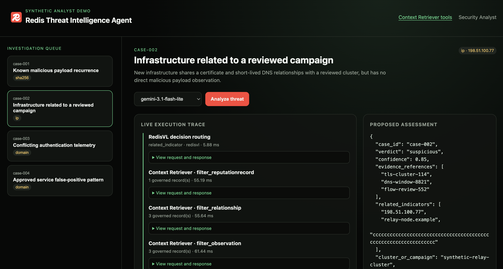

# Redis Threat Intelligence Agent

Redis Threat Intelligence Agent is a synthetic threat-intelligence analyst demo built from the
reusable RedisXADK infrastructure. It analyzes curated investigations, retrieves governed evidence,
and returns a proposed assessment for human review.

The demo never publishes or enforces an assessment. Every indicator and observation is synthetic.

## Demo

The interface shows the synthetic investigation queue, governed Context Retriever activity, live
execution traces, and proposed assessments for analyst review.



## Capabilities

- FastAPI newline-delimited JSON streaming and a live execution trace;
- Google ADK orchestration with Gemini, without Agent Platform Sessions or Memory Bank;
- Redis database connectivity and exact evidence lookup;
- Redis Context Retriever for governed evidence entities and relationships;
- RedisVL semantic decision routing and shared embedding cache;
- Redis Agent Memory for analyst session continuity and durable workflow preferences;
- Redis LangCache plumbing restricted to stable analyst guidance, never final verdicts;
- health probes, graceful shutdown, container packaging, and shared-VM deployment foundations.

## Local setup

```bash
cp .env.example .env
uv sync --all-extras
make setup-redis
make dev
```

Open [http://localhost:8082](http://localhost:8082). The local app uses port `8082` so it can share
the existing demo VM without colliding with the services on ports `8080` and `8081`.

Keep live credentials only in the gitignored `.env`. Use `REDIS_URL` for the laptop-accessible
endpoint and `VM_REDIS_URL` for the private VM endpoint.

## Synthetic investigations

The first vertical slice contains four evidence-grounded cases:

1. an exact reviewed file-hash recurrence corroborated by web, sandbox, and endpoint telemetry;
2. infrastructure related by certificate reuse and passive DNS, without a captured payload;
3. a concerning endpoint event contradicted by clean sandbox and sparse DNS evidence;
4. a beacon-like service verified through ownership, certificate, cadence, and workflow evidence.

The proposed result contains a verdict, confidence, evidence references, related indicators,
decision path, artifact type and validity, scope, action, conflicts, gaps, false-positive risk,
provenance, explanation, and `status=proposed`. Evaluation labels are test-only and are never
included in runtime evidence or routing inputs.

## Validation

```bash
make lint
make test
curl -fsS http://127.0.0.1:8082/api/health
```

No deployment is performed by these commands.
